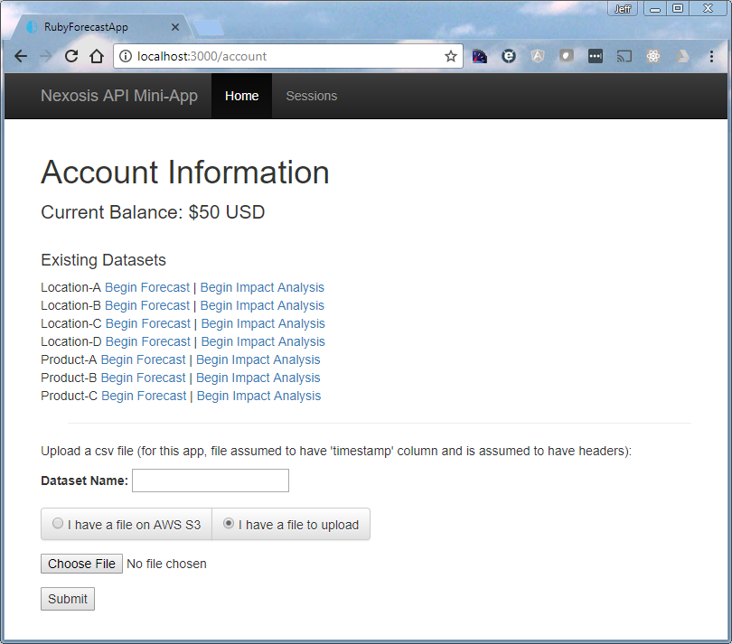
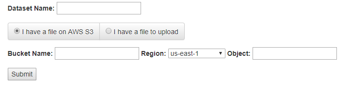
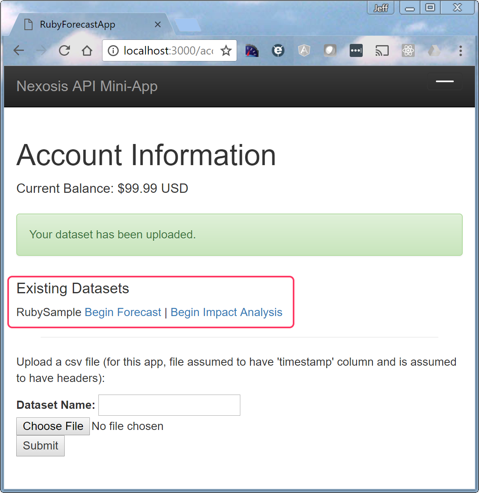
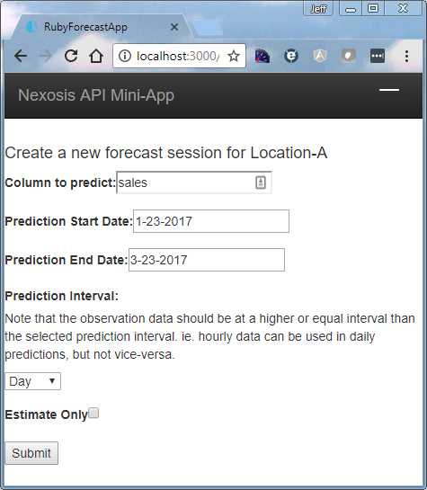
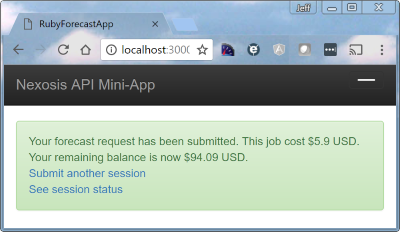
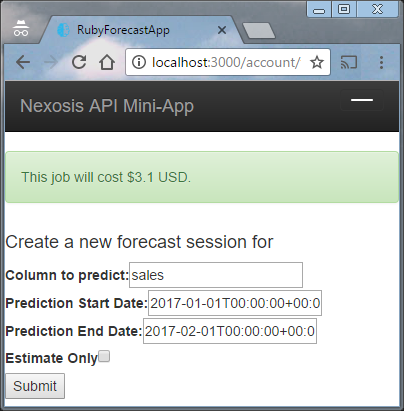
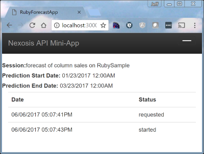
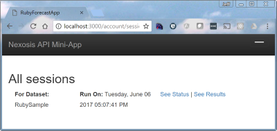
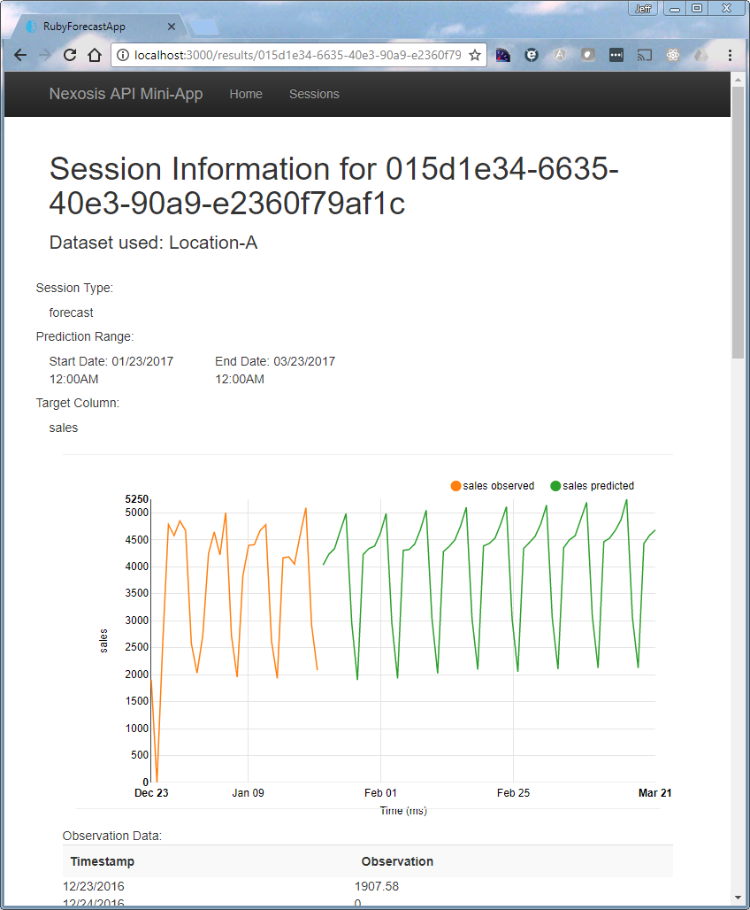

[](https://travis-ci.org/Nexosis/samples-rb)
Rails Sample Application
===
This sample application is intended as a guided tour of the Nexosis API as well as a simple way to view your own data and associated results. We'll walk through the application below and use the walkthrough to explain major concepts at work in the API and introduce you to how you can interact with it.

#### Concepts Covered
* [Datasets](#Datasets)
* [Sessions](#Sessions)
* [Processing Results](#Results)
* [Impact Analysis](#Impact)
 
### What's In the Sample
* Sample API Client in Ruby
  * calls to all endpoints (will be updated as more are added)
  * converts json responses to strongly typed objects
  * currently integrated with Rails caching - will be extracted as generic Ruby class and lose caching.
  * requires that your API key is added to secrets.yml
* Viewing session results
  * session status
  * session prediction results
  * session model data

Getting Started
---
If you will be following along with your own instance of the application then I suggest you visit <a href="https://developers.nexosis.com/" target="_blank">the API website</a> to get your own API key. Once you have an API key you'll need to add a secrets.yml file to the config folder of the ruby application directory. Within this file simply enter the following:
``` yaml
shared:
    api_key: myapikeyvaluegoeshere
```
If you want to run locally, you'll need to be capable of running a Rails server. See <a href="https://www.tutorialspoint.com/ruby-on-rails/rails-installation.htm" target="_blank">this tutorial</a> to get up and running with Rails. Once available, navigate to the download (where you cloned the source) directory and enter the following commands:
``` bash
gem install bundler
bundle install
rails server
```

Datasets & Sessions
---
A *dataset* in the Nexosis API is a collection of observations on which a forecast or impact analysis will be run. The API allows you to upload a dataset independent of any request to perform work on it, or to submit data at the same time as a request to perform the work. We call a request to perform the forecast or impact analysis work a *session*. With your api key placed in config/secrets.yml you're ready to interact with the API. The landing page is at http://localhost:3000/account. If you added sample data during sign up then your page should look like this:



Note that we've read your available balance from the headers on a session request wrapped in the *get_account_balance* method in the api_client.rb file
``` ruby
def get_account_balance
	session_url = '/sessions'
	Rails.cache.fetch(session_url + '_balance', expires_in: 2.minute) do
		response = self.class.get(session_url,@options)
		response.headers["nexosis-account-balance"]
	end
end
```
### Datasets
<a name="Datasets"></a>
This application helps you load a CSV file you have locally as a dataset (*the API also accepts json input*). 
> If you don't have a dataset of your own, trying using one of our publicly available samples at https://github.com/Nexosis/sampledata

In order to have a named dataset you must also provide that name. Once you have provided the name, and selected a file you can click the submit button. Again, this is a distinct operation from submitting a session request which would do work - we'll get to that soon. The api client for this application has been written to upload only 5000 lines at a time because we're sending the data as the request body and need to mind limits.
``` ruby
csv.each do |row|
	rowCount += 1
	content.concat(row.map {|str| "\"#{str}\""}.join(',')).concat("\r\n")
	if(rowCount % 5000 == 0 || rowCount == csv.length)
		response = self.class.put(dataset_url, {:headers => headers, :body => content})
		content = ""
	end
end
```
You may also notice in the snippet above that the CR/LF line feed type has been forced between each line to follow the CSV specification and play nice with our underlying parser.
>Importing from AWS S3 is recommended for production datasets. You can use the imports capability of the API directly - or within this app just select "I have a file on AWS S3" on the landing page:

#### Modifying a Dataset
Once you have a named dataset you can submit data again with the same name and either modify previously submitted data or add new. This is why we recommend using named datasets over sending data with a session request. With time series data the timestamp column will be used as the key for performing the upsert on your named dataset.
### Sessions
<a name="Sessions"></a>
Now that a dataset has been loaded you should see a new line on the */account* page such as that shown outlined in red below.



Notice that next to the dataset name *RubySample* there are two links - one to create a forecast and another to create an impact analysis. These activities will create sessions based on the named dataset. 
> As mentioned previously - it is possible to send data in a session request instead. It will be given a generated name and will only be used in that one session. Everything else will be the same as demonstrated in this application.

If you click on *Begin Forecast* you'll be asked for some additional data to specify the parameters of the forecast job to be run.



In the example above I have used the *Location A.csv* sample data file. You should note that the column to predict must be one of the non-timestamp columns in your file. If you load a csv without headers, you will get a header named after your first row - so best to include headers in all files. In this case the file contained both a *sales* and a *transactions* column and we've requested predictions on the sales column. The start and end dates for predictions must coincide with the dates available in the file. For example, it's ok to ask for dates within the file, or overlapping the end, or from the end to some other point. However, if you select a date beyond the end of the observations dates for your prediction start date you won't get results.  In this case we're asking for predictions to start after the last day of observations and going out two months.



Having started off the session we can now see two new links - one to start over and request another session on the same dataset, and another to see the status of the session we've submitted. 
#### Session Estimates
You might have noticed the checkbox to "estimate" the forecast session in the screenshot above. If you want to figure out what something will cost before you do it, just send the "isEstimate=true" value in the query string of your request. In the case of our mini-app you'll see the value returned to you at the top of the page.



Your values have been pre-filled, so if you're ready to go ahead just hit the submit button again.
<hr/>
Sessions will take longer to run the first time you request them on a dataset because we run our algorithm selection process to determine how best to forecast your result. While we will run this again in the future to make sure we keep giving the best results, we will keep the selection around for a while, making subsequent sessions on the same dataset run much more quickly. 

>  If you submit data and run a session we will run the algorithm selection process every time.



As you can see, this session hasn't quite completed yet. You can wait for a bit and then refresh this page, or go ahead and click the "Sessions" menu item to see all sessions. Maybe go grab a drink or sandwich and come back - in about 8 minutes if you're using our sample dataset.

Good, you're back. The results are in and we now see an link on the *All sessions* page to view the results.



If you click on the *See Results* link you'll be presented with a visualization of the data, the data itself, and a link to see some information about how we created the forecast. This is a bit busier page than others, but really its just your observations from the dataset and Nexosis' forecasts as requested from your session.



### Processing API Results
<a name="Results"></a>
Now that we've run once end to end, let's take a closer look at how we actually processed the information coming back from the Nexosis API.

#### Session Object
First off, when we requested a forecast session we immediately received a session object as json.
``` json
{
   "sessionId":"015c7e7e-3ddf-4f13-9f03-4b3d2877ef1c",
   "type":"forecast",
   "status":"requested",
   "statusHistory":[
      {
         "date":"2017-06-06T17:40:21.599475+00:00",
         "status":"requested"
      }
   ],
   "extraParameters":{},
   "dataSetName":"RubySample",
   "targetColumn":"sales",
   "startDate":"2017-01-23T00:00:00+00:00",
   "endDate":"2017-03-23T00:00:00+00:00",
   "callbackUrl":null,
   "links":[
      {
         "rel":"results",
         "href":"https://ml.nexosis.com.com/api/sessions/015c7e7e-3ddf-4f13-9f03-4b3d2877ef1c/results"
      },
      "elided for brevity" : "..."
   ]
}
```
This object tells us the current status is 'requested', echos back some of what we told the session, and provides links to the Nexosis API where we might get additional information. If you're using one of our client libraries you don't really need to worry about the links - but in all cases the important thing for us is to somehow get hold of the sessionId value. This guid uniquely identifies your session and is the key to getting the results of that session (*If you lose track of it, you can always list out all your sessions from the /sessions endpoint*). Inside the Ruby sample application we've created a class to hold this session data similar to all other json-based DTOs used in this client and all our other language clients.

``` ruby
module NexosisApi
	class Session
		def initialize(sessionHash)
			sessionHash.each do |k,v|
				if(k == "links")
					links = Array.new
					v.each do |l| links << NexosisApi::Link.new(l) end
					instance_variable_set("@#{k}", links) unless v.nil?
				else
					instance_variable_set("@#{k}", v) unless v.nil?
				end
			end
		end
		attr_accessor :sessionId
		attr_accessor :type
		attr_accessor :status
		attr_accessor :statusHistory
		attr_accessor :extraParameters
		attr_accessor :dataSetName
		attr_accessor :targetColumn
		attr_accessor :startDate
		attr_accessor :endDate
		attr_accessor :links
	end
end
```

#### Session Results
When the session has completed we can make a call to get the results. The call to get results returns a session object again, but now also includes a data object. This simple data object provides a timestamp for the prediction and then a values collection that will contain only the column on which you requested a prediction. The value provided is the predicted value. 

``` json
{
   "metrics":{},
   "session":{
      "a session just like above. elided for brevity":"..."
   },
   "data":[
      {
         "timestamp":"2017-01-23T00:00:00+00:00",
         "values":{
            "sales":3942.12925494088
         }
      },
      {
      	"lots of other values elided" : "..."
      }
      {
         "timestamp":"2017-03-22T00:00:00+00:00",
         "values":{
            "sales":4974.02521814307
         }
      }
   ]
}
```
In order to build a visualization as in this sample application you need to pull back your observations. Obviously if you submitted them from a database or other local data store in the first place, that's a good place to get them from again on your application. In the case of this sample app we're pulling them back from the stored dataset via the Nexosis API. 

#### Impact Sessions
<a name="Impact"></a>
While similar in most regards, there are a couple of differences to note about impact analysis sessions. First, they'll take longer to run. We utilize a more complex algorithm with multiple iterations to land on the most accurate understanding of the given event's impact. Second, impact sessions utilize the dates for an event during which you want to understand the impact. Naturally these dates need to fall within the observation dates to make sense. It's also best in practice to measure events on smaller timeframes relative to the overall observation set as a long running event just becomes the new normal and loses predictive value. Finally, we provide a few metrics around the impact analysis to help you understand what we've found. This information populates the *metrics* object on the response json for an impact session:

``` json
{
   "metrics":{
      "pValue":0.1766,
      "absoluteEffect":446.6068,
      "relativeEffect":0.0792
   },
   "session removed" : "...",
   "data removed" : "..."
}
```
The results above come from running an impact analysis on the transactions column of the Location C sample dataset from 5/1/2016-5/10/2016. If you run these yourself you'll see the metrics on the results page of the session in the sample application.
- **pValue**: Statistical value used to determine the significance of the impact. A small p-value indicates strong evidence of impact, whereas a p-value approaching 0.5 indicates weak evidence of impact. In the example above we have a ambiguous result - which is reasonable given that no known event actually occurred on the dates provided.
- **absoluteEffect**: Total absolute effect of the event on the dataset. Answers the question, "How much did this event affect my dataset?" During the 10 days of this example impact run, transactions were postively impacted by a 446 transaction increase. This is a relatively strong impact - but again with an ambiguous meaning given the p-value.
- **relativeEffect**: Percentage impact of the event on the dataset. Answers the question, "By what percentage did this event affect my dataset?". While closely related to the absolute effect, this is a percentage of the mean of all predictions created during an iterative process - not the strict percentage of the absolute against observed or predicted totals within the impact time slice. 

Developer Notes
---
If you're a Ruby developer and have mucked about in this project code then maybe you have said "What'd they do that for?". You've caught me; I'm not a Ruby developer - but I do look forward to reviewing your pull requests.

If you're not a Ruby developer, but want to muck about in this code then I suggest <a href="https://www.jetbrains.com/ruby/" target="_blank">Jet Brains RubyMine</a> if you have the capital. If not, I really like <a href="https://code.visualstudio.com/download" target="_blank">VS Code</a> on both the Mac and the PC. Check out <a href="https://github.com/rubyide/vscode-ruby" target="_blank">this article</a> to get started.
